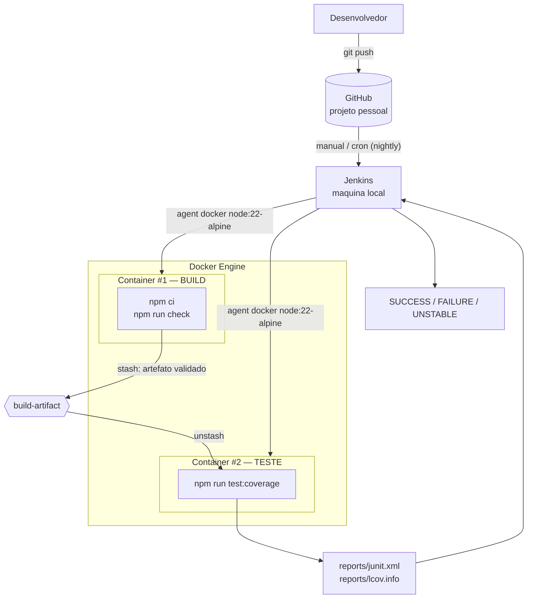

# API de Conversão de Temperatura

Projeto HTTP minimalista em Node.js para demonstrar uma pipeline Jenkins com um escopo simples: dois endpoints de conversão de temperatura.

> **Trabalho 2 — Jenkins + Docker.** Esta versão evolui a pipeline do Trabalho 1:
> agora o **build roda em um container Docker** e os **testes em outro container
> Docker isolado**. O passo a passo da arquitetura está em
> [docs/arquitetura-docker.md](docs/arquitetura-docker.md) e a explicação de cada
> cenário em [docs/jenkins-cenarios.md](docs/jenkins-cenarios.md).

## Arquitetura da pipeline (build e teste em containers isolados)



**Como ler o diagrama:** o Jenkins não roda mais o `npm` no próprio agente. Ele
pede ao Docker que suba um container exclusivo para o **build** (`npm ci` +
`npm run check`, o equivalente à "compilação" em um projeto JS). Esse container
empacota o código já validado (`stash`) e é descartado. Em seguida, um **segundo
container, limpo e isolado**, recupera esse artefato (`unstash`) e executa os
casos de teste. Assim, o que foi construído é exatamente o que é testado, mas em
ambientes separados.

## Requisitos

- Node.js 22 ou superior
- npm 11 ou superior

## Como executar localmente

```bash
npm run check
npm test
npm start
```

Servidor padrão:

```text
http://localhost:3000
```

## Endpoints

- `GET /docs`
- `GET /openapi.json`
- `GET /fahrenheit-to-celsius?value=212`
- `GET /celsius-to-fahrenheit?value=100`

## Teste manual com Scalar

Com o servidor rodando, abra:

```text
http://localhost:3000/docs
```

Essa rota usa o Scalar para testar manualmente os endpoints pelo navegador.

## Exemplos

```http
GET /fahrenheit-to-celsius?value=32
```

Resposta:

```json
{
  "input": {
    "scale": "F",
    "value": 32
  },
  "output": {
    "scale": "C",
    "value": 0
  }
}
```

```http
GET /celsius-to-fahrenheit?value=0
```

Resposta:

```json
{
  "input": {
    "scale": "C",
    "value": 0
  },
  "output": {
    "scale": "F",
    "value": 32
  }
}
```

## Pipeline no Jenkins (com Docker)

O [Jenkinsfile](Jenkinsfile) usa `agent none` no nível do pipeline e declara um
container Docker por etapa:

- **Stage Build (container #1):** `npm ci` + `npm run check` (validação de
  sintaxe = "compilação"). Em caso de sucesso, faz `stash` do artefato validado.
- **Stage Test (container #2):** `unstash` do artefato e `npm run test:coverage`,
  gerando `reports/junit.xml` e `reports/lcov.info`. Uma falha de teste é
  capturada com `catchError` e marca o build como `UNSTABLE`.

### Pré-requisitos no Jenkins

- Docker Desktop em modo **Linux containers** e em execução;
- plugin **Docker Pipeline** instalado;
- permissão do Jenkins para usar o Docker.

### Reproduzir localmente as duas etapas (sem Jenkins)

Os mesmos comandos dos dois containers podem ser rodados à mão para validar antes
de gravar:

```bash
# Etapa de build (container #1)
docker run --rm -v "$PWD:/app" -w /app node:22-alpine sh -c "npm ci && npm run check"

# Etapa de teste (container #2)
docker run --rm -v "$PWD:/app" -w /app node:22-alpine sh -c "npm run test:coverage"
```

Os detalhes dos cenários para demonstração estão em
[docs/jenkins-cenarios.md](docs/jenkins-cenarios.md) e o desenho completo da
arquitetura em [docs/arquitetura-docker.md](docs/arquitetura-docker.md).
