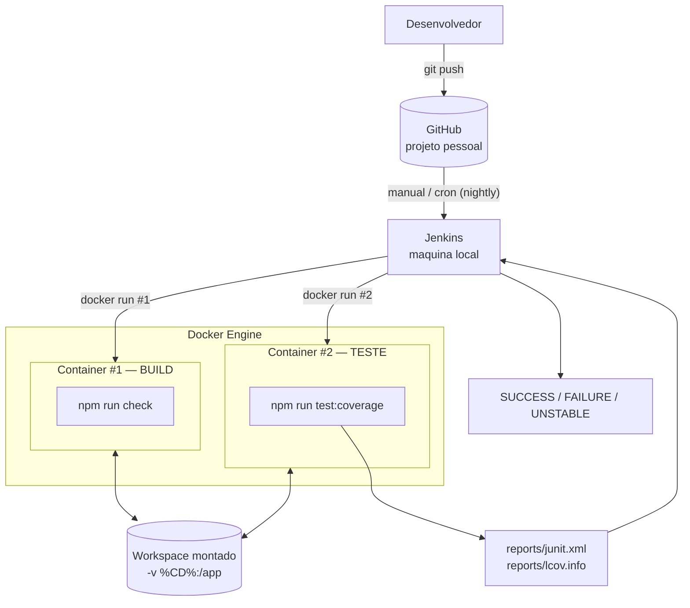

# API de Conversão de Temperatura

Projeto HTTP minimalista em Node.js para demonstrar uma pipeline Jenkins com um escopo simples: dois endpoints de conversão de temperatura.

> **Trabalho 2 — Jenkins + Docker.** Esta versão evolui a pipeline do Trabalho 1:
> agora o **build roda em um container Docker** e os **testes em outro container
> Docker isolado**. O passo a passo da arquitetura está em
> [docs/arquitetura-docker.md](docs/arquitetura-docker.md) e a explicação de cada
> cenário em [docs/jenkins-cenarios.md](docs/jenkins-cenarios.md).

## Arquitetura da pipeline (build e teste em containers isolados)



**Como ler o diagrama:** o Jenkins não roda mais o `npm` no próprio agente. Cada
etapa faz um `docker run` próprio: um container exclusivo para o **build**
(`npm run check`, a "compilação" de um projeto JS sem dependências) e, em
seguida, um **segundo container, limpo e isolado**, para os **testes**. Os
dois montam o mesmo workspace (`-v "%CD%":/app -w /app`), então os fontes e os
relatórios trafegam pelo volume. Assim, o que foi construído é exatamente o que
é testado, mas em ambientes separados (hostnames diferentes no log comprovam o
isolamento).

## Requisitos

- Node.js 22 ou superior
- npm 11 ou superior

## Como executar localmente

```bash
npm run check
npm test
npm start
```

Servidor padrão:

```text
http://localhost:3000
```

## Endpoints

- `GET /docs`
- `GET /openapi.json`
- `GET /fahrenheit-to-celsius?value=212`
- `GET /celsius-to-fahrenheit?value=100`

## Teste manual com Scalar

Com o servidor rodando, abra:

```text
http://localhost:3000/docs
```

Essa rota usa o Scalar para testar manualmente os endpoints pelo navegador.

## Exemplos

```http
GET /fahrenheit-to-celsius?value=32
```

Resposta:

```json
{
  "input": {
    "scale": "F",
    "value": 32
  },
  "output": {
    "scale": "C",
    "value": 0
  }
}
```

```http
GET /celsius-to-fahrenheit?value=0
```

Resposta:

```json
{
  "input": {
    "scale": "C",
    "value": 0
  },
  "output": {
    "scale": "F",
    "value": 32
  }
}
```

## Pipeline no Jenkins (com Docker)

O [Jenkinsfile](Jenkinsfile) usa `agent any` e sobe um container Docker por etapa
com `docker run` explícito:

- **Stage Build (container #1):** `docker run ... node:22-alpine sh -c "npm run
  check"` (validação de sintaxe = "compilação"; sem dependências, não há
  `npm install`). Se falhar, o stage de teste é pulado.
- **Stage Test (container #2):** outro `docker run` com `npm run test:coverage`,
  gerando `reports/junit.xml` e `reports/lcov.info`. Uma falha de teste é
  capturada com `catchError` e marca o build como `UNSTABLE`.

> Usamos `docker run` explícito (em vez de `agent { docker { ... } }`) porque o
> Jenkins roda em **Windows**: o agente declarativo do plugin monta o workspace
> com caminho do Windows dentro de um container Linux e falha. Detalhes em
> [docs/arquitetura-docker.md](docs/arquitetura-docker.md).

### Pré-requisitos no Jenkins

- Docker Desktop em modo **Linux containers** e em execução;
- **Docker CLI** acessível ao Jenkins (não é necessário o plugin Docker Pipeline);
- plugin **Git** para o checkout do repositório.

### Reproduzir localmente as duas etapas (sem Jenkins)

Os mesmos comandos dos dois containers podem ser rodados à mão para validar antes
de gravar:

```bash
# Etapa de build (container #1)
docker run --rm -v "$PWD:/app" -w /app node:22-alpine sh -c "npm run check"

# Etapa de teste (container #2)
docker run --rm -v "$PWD:/app" -w /app node:22-alpine sh -c "npm run test:coverage"
```

Documentação de apoio:

- Cenários para demonstração: [docs/jenkins-cenarios.md](docs/jenkins-cenarios.md)
- Arquitetura completa: [docs/arquitetura-docker.md](docs/arquitetura-docker.md)
- **Tutorial de setup + roteiro de gravação** (cenas e cenários):
  [docs/roteiro-video.pdf](docs/roteiro-video.pdf)
- **Roteiro de apresentação** (script teleprompter para o vídeo único do YouTube):
  [docs/roteiro-apresentacao.pdf](docs/roteiro-apresentacao.pdf)
