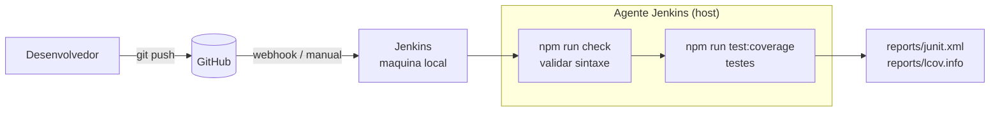
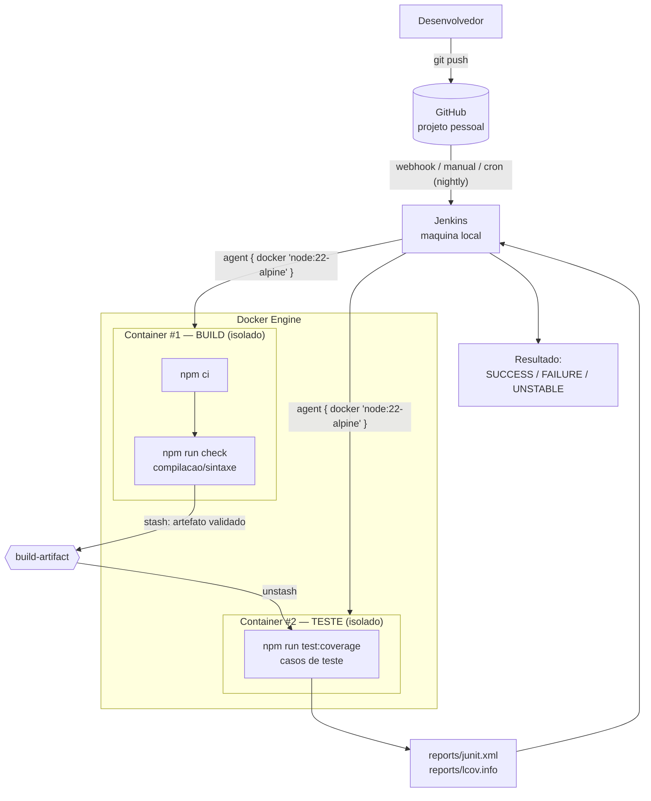
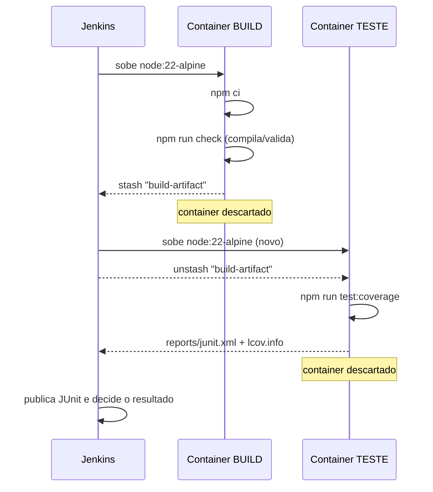

# Arquitetura — Jenkins + Docker (Trabalho 2)

Este documento explica **como o pipeline saiu da estratégia do Trabalho 1**
(build e testes rodando direto na máquina do Jenkins) **para a estratégia do
Trabalho 2**, em que o build e os testes acontecem em **containers Docker
isolados** — um container só para o build e outro só para o teste.

A ideia é que qualquer pessoa que já conhece Jenkins consiga entender a
adaptação lendo este arquivo de cima a baixo.

---

## 1. O que mudou em uma frase

> Antes o Jenkins executava `npm` direto no agente. Agora o Jenkins **pede ao
> Docker** que suba um container para compilar/validar os fontes e **outro
> container, separado**, para rodar os casos de teste.

---

## 2. Antes x Depois

### Antes — Trabalho 1 (tudo no agente Jenkins)

Problema: build e teste compartilham **o mesmo ambiente** (o host do Jenkins).
A versão do Node, o cache e qualquer "sujeira" instalada na máquina influenciam
o resultado. Não há isolamento entre as etapas.

### Depois — Trabalho 2 (containers isolados)

Agora cada etapa roda em um container `node:22-alpine` recém-criado e
descartado ao final. O build não enxerga o ambiente do teste e vice-versa.

---

## 3. Como o artefato passa de um container para o outro

O ponto mais importante da adaptação é o **handoff** entre os dois containers.
Como eles são isolados, o teste não tem acesso direto ao que o build produziu.
Resolvemos isso com o mecanismo nativo do Jenkins:

1. O **container de build** roda `npm ci` + `npm run check` e, ao terminar com
   sucesso, faz `stash` dos fontes já validados (`build-artifact`).
2. O **container de teste**, recém-criado e limpo, faz `unstash 'build-artifact'`
   e só então roda os testes.

Esse fluxo é o que comprova, no log do Jenkins, que **o que foi construído em um
container é exatamente o que foi testado no outro**.

---

## 4. Por que "build" aqui é `npm ci` + `npm run check`

Em Java o build é a compilação (`javac` / `mvn compile`). Em um projeto
JavaScript puro não há bytecode para gerar, então o equivalente à compilação é:

- `npm ci` — preparar o ambiente / instalar dependências a partir do lockfile;
- `npm run check` — rodar `node --check` em todos os fontes, que falha se houver
  erro de sintaxe (chave faltando, função mal fechada etc.).

Ou seja, um **erro de sintaxe quebra o "build"** da mesma forma que um erro de
compilação quebraria em Java — e é exatamente isso que o Cenário 2 explora.

---

## 5. Mapa dos 4 cenários nesta arquitetura

| Cenário | O que acontece | Container que falha | Resultado |
|--------|----------------|---------------------|-----------|
| 1 — tudo certo | build e teste passam | nenhum | `SUCCESS` |
| 2 — deu ruim | `npm run check` falha | **Build** (o Teste nem sobe) | `FAILURE` |
| 3 — tá instável | build passa, um teste falha | **Teste** (via `catchError`) | `UNSTABLE` |
| 4 — nightly | `cron('H 8 * * 1-5')` dispara sozinho | nenhum | `SUCCESS` |

> Detalhe importante do Cenário 2: como o **stash** só acontece no `post { success }`
> do build, se a compilação falha **o container de teste nem chega a ser criado**.
> Isso deixa visível no pipeline que a falha foi na etapa de build.

---

## 6. Pré-requisitos na máquina do Jenkins

Para os agentes `docker { ... }` funcionarem:

- **Docker Desktop** instalado e em modo **Linux containers** (as imagens usadas
  são `node:22-alpine`, que são Linux).
- Plugin **Docker Pipeline** instalado no Jenkins.
- O usuário que roda o serviço do Jenkins precisa ter permissão para falar com o
  Docker (no Windows, basta o Docker Desktop estar rodando para o mesmo usuário).

Os detalhes passo a passo de configuração e dos cenários estão em
[jenkins-cenarios.md](jenkins-cenarios.md).
