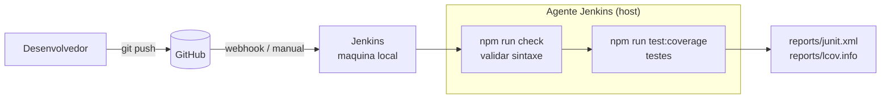
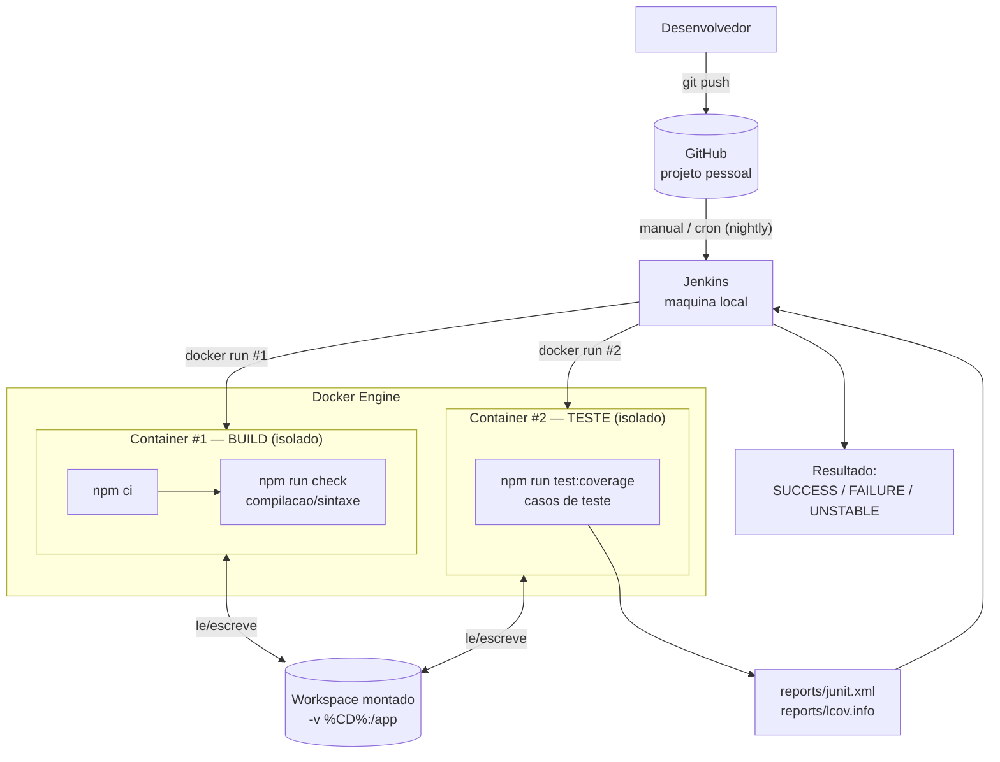
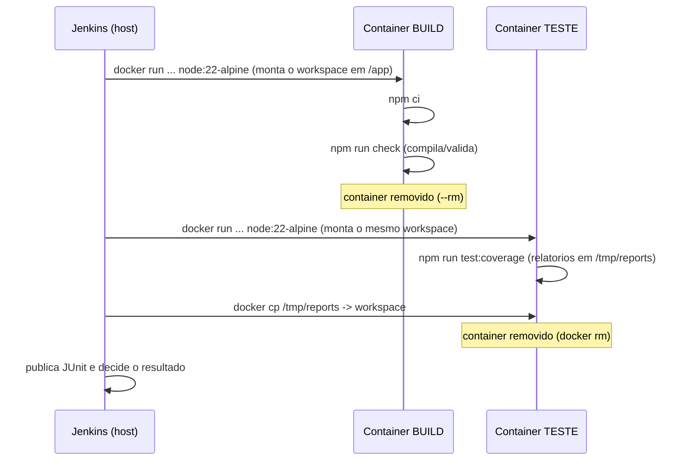

# Arquitetura — Jenkins + Docker (Trabalho 2)

Este documento explica **como o pipeline saiu da estratégia do Trabalho 1**
(build e testes rodando direto na máquina do Jenkins) **para a estratégia do
Trabalho 2**, em que o build e os testes acontecem em **containers Docker
isolados** — um container só para o build e outro só para o teste.

A ideia é que qualquer pessoa que já conhece Jenkins consiga entender a
adaptação lendo este arquivo de cima a baixo.

---

## 1. O que mudou em uma frase

> Antes o Jenkins executava `npm` direto no agente. Agora cada etapa faz um
> **`docker run`** próprio: um container sobe para compilar/validar os fontes e
> **outro container, separado**, sobe para rodar os casos de teste.

---

## 2. Antes x Depois

### Antes — Trabalho 1 (tudo no agente Jenkins)



Problema: build e teste compartilham **o mesmo ambiente** (o host do Jenkins).
A versão do Node, o cache e qualquer "sujeira" instalada na máquina influenciam
o resultado. Não há isolamento entre as etapas.

### Depois — Trabalho 2 (containers isolados)



Agora cada etapa roda em um container `node:22-alpine` recém-criado e
descartado ao final (`--rm`). O build não enxerga o ambiente do teste e
vice-versa.

---

## 3. Como o código e os relatórios passam de um container para o outro

Os dois containers são isolados, mas **montam o mesmo diretório de trabalho** do
Jenkins (o *workspace*) através de um volume:

```
docker run --rm -v "%CD%":/app -w /app node:22-alpine sh -c "..."
```

- `-v "%CD%":/app` monta o workspace do Jenkins (com os fontes baixados do
  GitHub) dentro do container, em `/app`.
- `-w /app` usa `/app` como diretório de trabalho — um caminho **Linux** válido.

Assim, o container de build valida os fontes e o container de teste lê **esses
mesmos fontes** pelo volume. Os relatórios (`junit.xml` e `lcov.info`), porém,
são gravados **dentro do container** (em `/tmp/reports`, via `REPORTS_DIR`) e
extraídos pelo Jenkins com `docker cp`. Isso porque, no Windows, o serviço do
Jenkins **não tem permissão de escrita no volume montado** (erro `EACCES`); o
`docker cp` grava no workspace pela conta do próprio Jenkins, contornando o
problema.



No log do Jenkins, cada container imprime o seu `hostname` (o ID do container).
São **hostnames diferentes** — é isso que comprova que build e teste rodaram em
containers separados.

---

## 4. Por que `docker run` explícito (e não `agent { docker }`)

O Jenkins declarativo tem o açúcar sintático `agent { docker { image '...' } }`,
fornecido pelo plugin *Docker Pipeline*. Ele é muito prático **em agentes
Linux**, mas neste projeto o Jenkins roda em **Windows**. Nesse cenário o plugin
monta o workspace usando o caminho do Windows e define o diretório de trabalho
como `-w C:/...`, que **não é um caminho absoluto válido dentro de um container
Linux** (`node:22-alpine`). O resultado é o erro:

```
docker: Error response from daemon: the working directory
'C:/ProgramData/Jenkins/.../workspace/...' is invalid, it needs to be
an absolute path
```

Para contornar isso de forma robusta, usamos `agent any` + `docker run`
explícito, controlando nós mesmos o volume (`-v "%CD%":/app`) e o diretório de
trabalho (`-w /app`, um caminho Linux válido). Continuam sendo **dois containers
isolados** — só que comandados diretamente, sem depender do plugin.

> Vantagem extra: como não dependemos do plugin Docker Pipeline, basta o **Docker
> CLI** estar acessível ao Jenkins.

---

## 5. Por que "build" aqui é `npm ci` + `npm run check`

Em Java o build é a compilação (`javac` / `mvn compile`). Em um projeto
JavaScript puro não há bytecode para gerar, então o equivalente à compilação é:

- `npm ci` — preparar o ambiente / instalar dependências a partir do lockfile;
- `npm run check` — rodar `node --check` em todos os fontes, que falha se houver
  erro de sintaxe (chave faltando, função mal fechada etc.).

Ou seja, um **erro de sintaxe quebra o "build"** da mesma forma que um erro de
compilação quebraria em Java — e é exatamente isso que o Cenário 2 explora.

---

## 6. Mapa dos 4 cenários nesta arquitetura

| Cenário | O que acontece | Container que falha | Resultado |
|--------|----------------|---------------------|-----------|
| 1 — tudo certo | build e teste passam | nenhum | `SUCCESS` |
| 2 — deu ruim | `npm run check` falha | **Build** (o Teste nem sobe) | `FAILURE` |
| 3 — tá instável | build passa, um teste falha | **Teste** (via `catchError`) | `UNSTABLE` |
| 4 — nightly | `cron('* * * * *')` dispara sozinho | nenhum | `SUCCESS` |

> Detalhe importante do Cenário 2: como o stage de build falha, o Jenkins **pula
> o stage de teste** (`Stage "Test" skipped due to earlier failure(s)`). Ou seja,
> o segundo `docker run` nem chega a ser executado — deixa visível que a falha
> foi na etapa de build.

---

## 7. Pré-requisitos na máquina do Jenkins

- **Docker Desktop** instalado e em execução, no modo **Linux containers** (a
  imagem usada é `node:22-alpine`, que é Linux).
- **Docker CLI** acessível ao usuário/serviço que roda o Jenkins (no Windows,
  basta o Docker Desktop estar rodando e o `docker` no PATH).
- Plugin **Git** (para o checkout do repositório).

> Não é necessário o plugin *Docker Pipeline*: como subimos os containers com
> `docker run`, só precisamos do Docker CLI.

Os detalhes passo a passo de configuração e dos cenários estão em
[jenkins-cenarios.md](jenkins-cenarios.md), e o roteiro de gravação em
[roteiro-video.pdf](roteiro-video.pdf).
